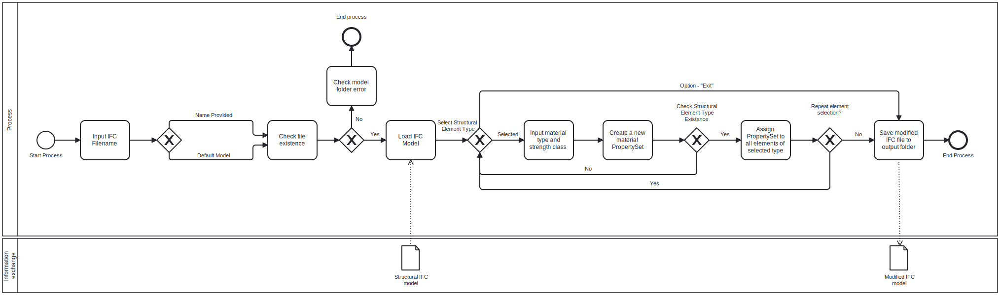
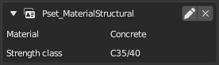
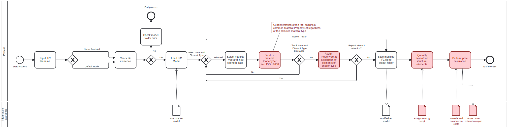

# Assignment 3 - Group 6

To ensure the script runs as intended, please set up the following folder hierarchy (alternatively download the entire *A3: OpenBIM Change* folder):

    1. Create a 'Root' folder (if it doesn't exist).
    
    2. Inside the 'Root' folder, create the necessary subfolders in the following structure:
    
    Root
        model
            LLYN - STRU.ifc
        output
        main.py

## Goals and Model Uses:
The BIM tool created for this task is best utilized alongside the one developed in Assignment 2. Its primary objective is to enhance the provided IFC model by incorporating properties typically associated with architectural IFC models, with a specific focus on material types. Furthermore, it introduces structural parameters, such as strength class, to provide a more comprehensive dataset for further processing.  
As a result the primary use case for this joined BIM tool is project cost estimation, with a specific focus on structural elements - columns, load bearing walls, beams and slabs. The main objective is to streamline the process of precise quantity takeoffs, provided that an IFC model of an appropriate development level is available. This tool aims to improve the decision making and accuracy in cost estimation for construction projects.

It can be used by all stakeholders involved in construction projects, especially those interested in the structural aspects. Designers can quickly compare various design concepts in terms of projected expenses, facilitating quick and informed decision making. Contractors, on the other hand, can efficiently estimate material costs for any given project. Furthermore, this tool has the potential to contribute in Life Cycle Assessment analysis.

## Process:
In its current version, the tool developed for this task operates as an independent module, focusing on the creation of a new PropertySets to incorporate and store information about material types and structural parameters of the building elements. An overall outline of the tool's processes is depicted in the BPMN diagram below:

After successfully executing the script and creating a new PropertySet, which is then added to the IFC model, a new file is saved to the output folder. Upon closer inspection using Blender software, we can confirm the implemented changes, as illustrated in the provided example:

While the current tool operates independently, its primary aim was to enhance the functionality of the tool developed in the previous assignment. This improvement would make the original tool more comprehensive, enabling a more thorough and intuitive cost estimation analysis. Presently, due to time and competency constraints, the tool assigns the new PropertySets under the generic name of "Pset_MaterialStructural," which does not adhere to ISO 19650 guidelines. To address this, the next steps in the development of this tool should refine the provided script to be more flexible and adapt the PropertySet names according to the provided material types. Furthermore, the ability to selectively apply the newly generated PropertySets to a specific element or a group of elements (instead of all elements of chosen category) would be a great feature to add.

## Information exchanges:
To make sure our tool works correctly and completes the script successfully, we depend on a clearly defined IFC structural model of an appropriate development level. The key requirement is that all structural elements include information about their type and dimensions, enabling accurate quantity take-off. We anticipate no change in the level of detail for the IFC model after using our BIM tool. We assume we're starting with a model corresponding to LOD 300, as per the AIA E202-2008/G202-2013 specification. This means that all quantities, shapes, quotations positions, and orientations are precise. Therefore, adding extra properties commonly found in architectural IFC models doesn't raise the LOD. In addition to a well-defined structural model, it's crucial that construction elements adhere to the ISO 19650 standard. This ensures the script can recognize and iterate through them.

